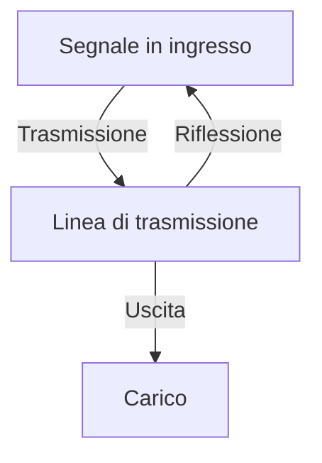
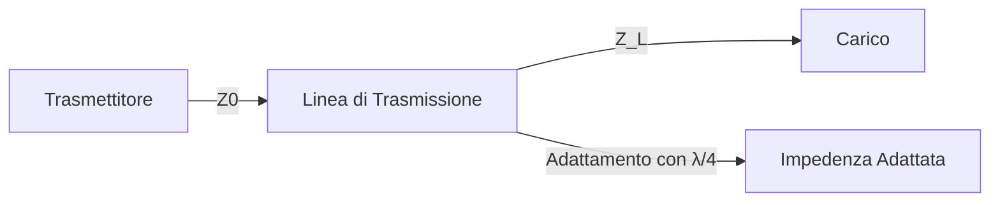
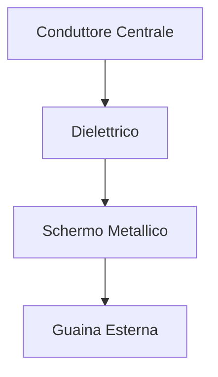

# Guida di Studio: Mezzi Trasmissivi Metallici

## Introduzione
Questa guida copre i concetti fondamentali dei mezzi trasmissivi metallici, incluse le coppie simmetriche, i cavi coassiali, la teoria delle linee di trasmissione, e i parametri associati.

## Linee di Trasmissione

Le linee di trasmissione possono essere:
- **Adattate**: nessuna riflessione del segnale.
- **Disadattate**: generano onde riflesse.

### Parametri delle Linee
- **Impedenza caratteristica (Z₀)**: determina la compatibilità tra la linea e il carico.
- **Coefficiente di riflessione (Γ)**:
  \[ \Gamma = \frac{Z_L - Z_0}{Z_L + Z_0} \]
- **Rapporto d’Onda Stazionaria (ROS)**:
  \[ ROS = \frac{1+|\Gamma|}{1-|\Gamma|} \]
- **Attenuazione (α)**: perdita di potenza lungo la linea.
- **Costante di fase (β)**: determina lo sfasamento del segnale lungo la linea.
- **Tempo di propagazione (τ)**:
  \[ \tau = \frac{d}{v_p} \]
  con \( v_p = \frac{c}{\sqrt{ε_r}} \)

## Adattamento d’Impedenza

Per ridurre le riflessioni si usa un **tronco di linea λ/4**:
\[ Z_{in} = \frac{Z_0^2}{Z_L} \]

## Tipologie di Cavi

### Coppie Simmetriche
- Comuni nei cavi telefonici.
- Sensibili alle interferenze.
- Richiedono schermature per alte frequenze.

### Cavi Coassiali
- **Struttura**:

- Miglior schermatura rispetto alle coppie simmetriche.
- Minore attenuazione alle alte frequenze.

## Calcoli Utili

### Lunghezza d’Onda
\[ \lambda = \frac{v_p}{f} \]

### Potenza Trasportata
\[ P = \frac{V^2}{Z_0} \]

### Perdita per Attenuazione
\[ P_{ricevuta} = P_{trasmessa} \cdot 10^{-\alpha L/10} \]

## Conclusione
Comprendere questi parametri è essenziale per progettare sistemi di trasmissione efficienti e ridurre le perdite di segnale dovute a disadattamenti o attenuazione.

# ESERCIZI:

# Risoluzione Esercizio 1

## Dati Forniti
- **R** = 150Ω/km
- **L** = 0.3mH/km = 0.3 × 10⁻³ H/km
- **C** = 50nF/km = 50 × 10⁻⁹ F/km
- **f** = 1MHz = 10⁶ Hz
- **Lunghezza linea** = 500m

## a) Conduttanza trasversale **G**
Dato che la linea è **non distorcente** (condizione di Heaviside):
\[
G = \frac{RC}{L} = \frac{(150 \times 50 \times 10^{-9})}{0.3 \times 10^{-3}}
\]
\[
G = 0.025 S/km = 25 μS/km
\]

## b) Costante di attenuazione **α**
\[
α = \sqrt{RG} = \sqrt{(150 \times 0.025)}
\]
\[
α = 1.936 Np/km
\]
Convertendo in dB/km:
\[
α_{dB} = 8.68 \times α = 16.8 dB/km
\]

## c) Costante di fase **β**
\[
β = \omega \sqrt{LC} = (2\pi \times 10^6) \times \sqrt{(0.3 \times 10^{-3} \times 50 \times 10^{-9})}
\]
\[
β = 1.37 \text{ rad/m}
\]

## d) Lunghezza d'onda **λ**
\[
λ = \frac{2\pi}{β} = \frac{2\pi}{1.37}
\]
\[
λ = 4.59m
\]

## e) Velocità di propagazione **vₚ**
\[
v_p = \frac{λ f}{1} = 4.59 \times 10^6
\]
\[
v_p = 4.59 \times 10^6 \, m/s
\]

## f) Tempo di propagazione **τ**
\[
τ = \frac{Lunghezza}{v_p} = \frac{500}{4.59 \times 10^6}
\]
\[
τ = 109 \mu s
\]

# Risoluzione Esercizio 2

## Dati Forniti
- **Impedenza caratteristica della linea**: \(Z_0 = 50Ω\)
- **Caso 1**: Carico resistivo \(Z_L = 100Ω\)
- **Caso 2**: Carico complesso \(Z_L = 30 + j40Ω\)

## Coefficiente di Riflessione **Γ**
La formula per il coefficiente di riflessione è:
\[
Γ = \frac{Z_L - Z_0}{Z_L + Z_0}
\]

### Caso 1: Carico Resistivo
\[
Γ = \frac{100 - 50}{100 + 50} = \frac{50}{150} = 0.333
\]

### Caso 2: Carico Complesso
\[
Γ = \frac{(30 + j40) - 50}{(30 + j40) + 50}
\]
Calcoliamo il numeratore:
\[
30 + j40 - 50 = -20 + j40
\]
E il denominatore:
\[
30 + j40 + 50 = 80 + j40
\]
Ora calcoliamo il modulo di entrambi:
\[
|80 + j40| = \sqrt{80^2 + 40^2} = \sqrt{6400 + 1600} = \sqrt{8000} \approx 89.44
\]
\[
|-20 + j40| = \sqrt{(-20)^2 + 40^2} = \sqrt{400 + 1600} = \sqrt{2000} \approx 44.72
\]
Ora calcoliamo il modulo di \(Γ\):
\[
|Γ| = \frac{44.72}{89.44} \approx 0.5
\]

Fase di \(Γ\):
\[
\theta = \tan^{-1}\left( \frac{40}{-20} \right) - \tan^{-1}\left( \frac{40}{80} \right)
\]
\[
\theta = \tan^{-1}(-2) - \tan^{-1}(0.5)
\]
\[
\theta \approx -63.43^\circ - 26.57^\circ = -90^\circ
\]
Quindi:
\[
Γ = 0.5 e^{-j90^\circ}
\]

# Risoluzione Esercizio 3

## Dati Forniti
- **Impedenza caratteristica**: \(Z_0 = 50Ω\)
- **Coefficiente di riflessione**: \(ρ_V = 0.27\)

## 1) Resistenza del carico \(R_L\)
La formula del coefficiente di riflessione per un carico puramente resistivo è:
\[
ρ_V = \frac{R_L - Z_0}{R_L + Z_0}
\]
Risolvendo per \(R_L\):
\[
R_L = Z_0 \frac{1 + ρ_V}{1 - ρ_V} = 50 \times \frac{1 + 0.27}{1 - 0.27}
\]
\[
R_L = 50 \times \frac{1.27}{0.73} = 87Ω
\]

## 2) Rapporto d'Onda Stazionaria (ROS)
La formula per il ROS è:
\[
ROS = \frac{1 + |ρ_V|}{1 - |ρ_V|}
\]
\[
ROS = \frac{1 + 0.27}{1 - 0.27} = \frac{1.27}{0.73} = 1.74
\]

## 3) Attenuazione di perdita per riflessione \(A_{pr}\)
\[
A_{pr} = -10 \log_{10}(1 - ρ_V^2)
\]
\[
A_{pr} = -10 \log_{10}(1 - 0.27^2) = -10 \log_{10}(1 - 0.0729)
\]
\[
A_{pr} = -10 \log_{10}(0.9271) = 0.34 dB
\]

## 4) Attenuazione di riflessione (Return Loss) \(A_r\)
\[
A_r = -20 \log_{10}(|ρ_V|)
\]
\[
A_r = -20 \log_{10}(0.27) = 11.37 dB
\]

## Esercizio 4

### Dati Forniti
- **Lunghezza della linea**: \( l = 50cm = 0.5m \)
- **Impedenza caratteristica**: \( Z_0 = 100Ω \)
- **Impedenza del carico**: \( Z_L = 150Ω \)
- **Lunghezza d’onda**: \( \lambda = 150cm = 1.5m \)

### Impedenza d'ingresso \( Z_{in} \)
La formula per l'impedenza d'ingresso di una linea di trasmissione è:
\[
Z_{in} = Z_0 \frac{Z_L + jZ_0 \tan(\beta l)}{Z_0 + jZ_L \tan(\beta l)}
\]
Dove:
\[
\beta = \frac{2\pi}{\lambda} = \frac{2\pi}{1.5} = 4.19 \text{ rad/m}
\]
\[
\beta l = 4.19 \times 0.5 = 2.095 \text{ rad}
\]
\[
\tan(\beta l) = \tan(2.095) \approx -1.73
\]

Ora calcoliamo \(Z_{in}\):
\[
Z_{in} = 100 \frac{150 + j100(-1.73)}{100 + j150(-1.73)}
\]
\[
Z_{in} = 100 \frac{150 - j173}{100 - j260}
\]
Approssimando:
\[
Z_{in} \approx 77.9 - j18.5Ω
\]

---

## Esercizio 5

### Dati Forniti
- **Impedenza caratteristica**: \(Z_0 = 50Ω\)
- **Lunghezza della linea**: \(l = 0.8\lambda\)

### a) Linea Aperta
Per una linea aperta:
\[
Z_{in} = jZ_0 \tan(\beta l)
\]
\[
Z_{in} = j50 \tan(2\pi \times 0.8)
\]
\[
\tan(1.6\pi) = \tan(144°) \approx -0.726
\]
\[
Z_{in} = j50 (-0.726) = -j36.3Ω
\]

### b) Linea in Corto
Per una linea in corto:
\[
Z_{in} = jZ_0 \tan(\beta l)
\]
\[
\tan(1.6\pi) = -0.726
\]
\[
Z_{in} = j50 (-0.726) = -j36.3Ω
\]
