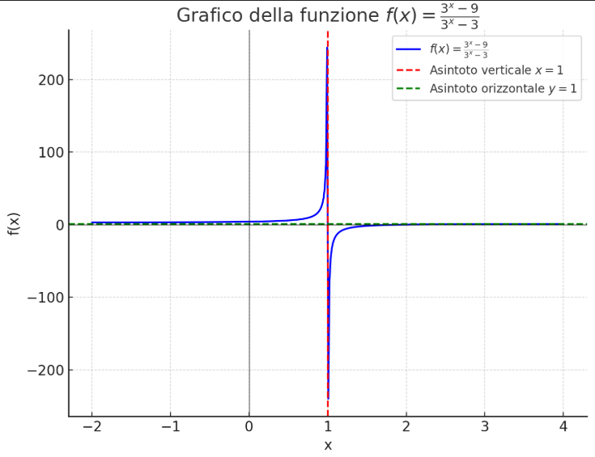

# Esercizio 5

\[
f(x) = \frac{3^x - 9}{3^x - 3}
\]

- **Dominio della Funzione**

\[
3^x - 3 = 0
\]

\[
3^x = 3
\]

\[
x = 1
\]

Quindi il dominio è:

\[
D = \mathbb{R} \setminus \{1\}
\]

- **Asintoto verticale**:  
  Per \( x = 1 \), il denominatore si annulla.

  \[
  \lim_{x \to 1} f(x) = \lim_{x \to 1} \frac{3^x - 9}{3^x - 3}
  \]

- **Asintoti orizzontali**:  

  \[
  \lim_{x \to +\infty} f(x), \quad \lim_{x \to -\infty} f(x)
  \]

1. **Asintoto verticale**:  

     \[
     \lim_{x \to 1^-} f(x) = -\infty, \quad \lim_{x \to 1^+} f(x) = +\infty
     \]

2. **Asintoto orizzontale**:
   - Per \( x \to \infty \):

     \[
     \lim_{x \to +\infty} f(x) = 1
     \]

   - Per \( x \to -\infty \):

     \[
     \lim_{x \to -\infty} f(x) = 3
     \]

   - **\( y = 1 \)** per \( x \to +\infty \)
   - **\( y = 3 \)** per \( x \to -\infty \)

# Grafico

